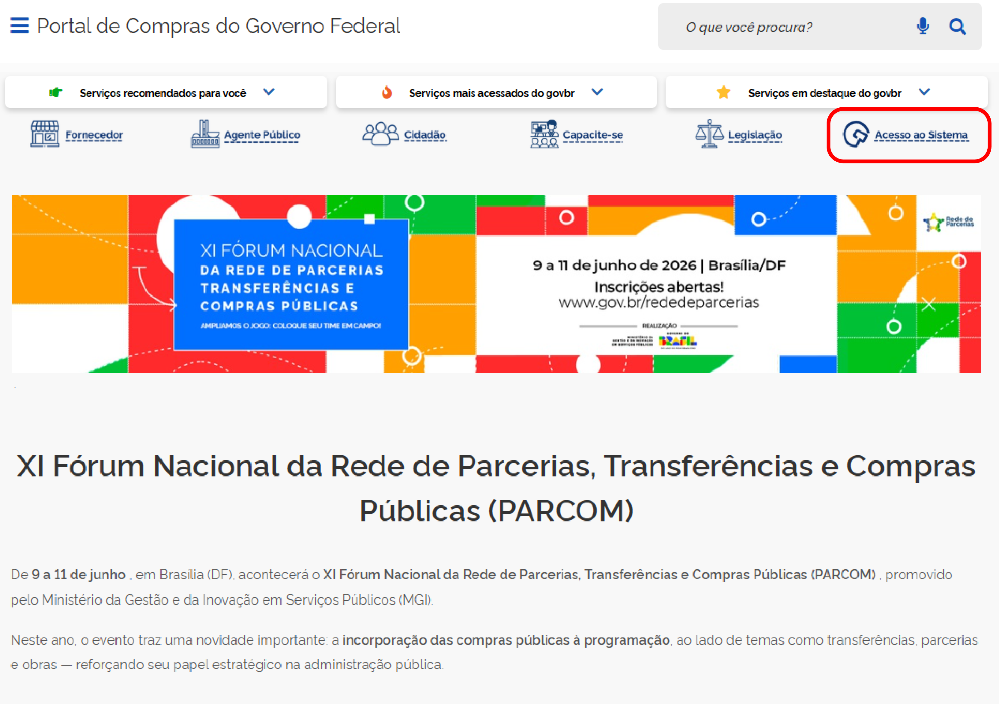
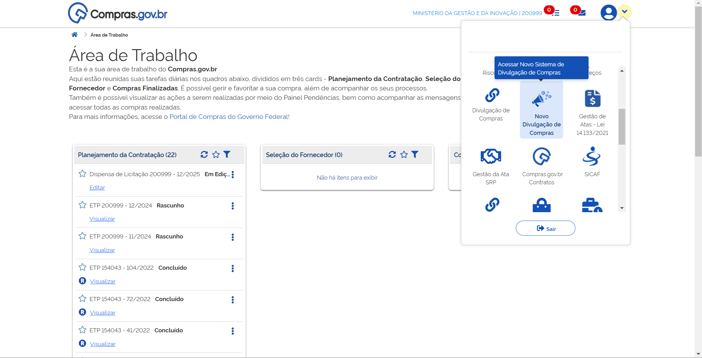
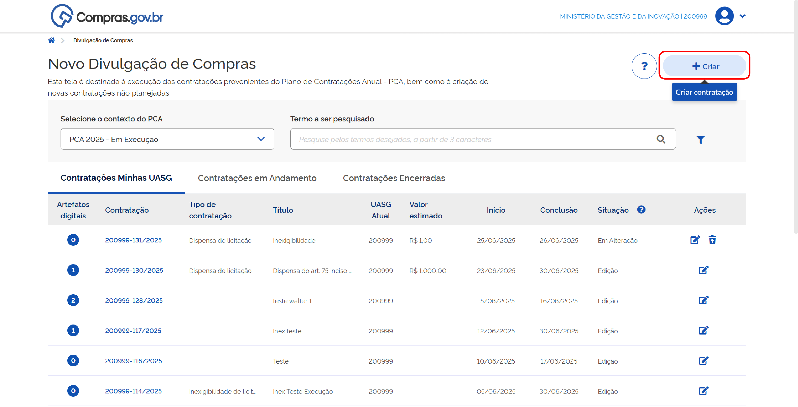
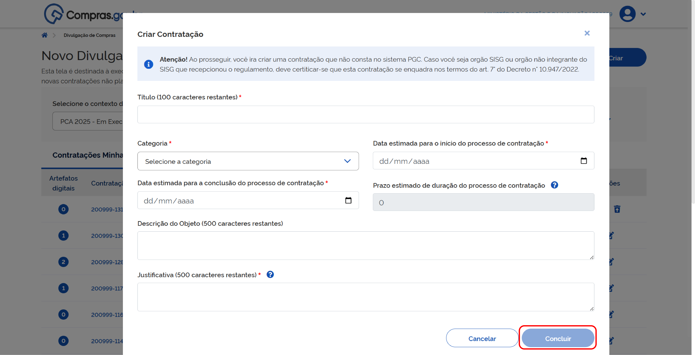

  Tamanho do texto:
  <button onclick="diminuirFonte()" title="Diminuir texto" style="padding: 6px 12px; font-weight: bold; cursor: pointer; border: 1px solid #ccc; border-radius: 4px; background: #f8f9fa;">A-</button>
  <button onclick="resetarFonte()" title="Tamanho normal" style="padding: 6px 12px; font-weight: bold; cursor: pointer; border: 1px solid #ccc; border-radius: 4px; background: #f8f9fa;">A</button>
  <button onclick="aumentarFonte()" title="Aumentar texto" style="padding: 6px 12px; font-weight: bold; cursor: pointer; border: 1px solid #ccc; border-radius: 4px; background: #f8f9fa;">A+</button>
  
  <button onclick="window.print()" style="background-color: #0056b3; color: white; padding: 6px 16px; border: none; border-radius: 5px; font-size: 14px; cursor: pointer; box-shadow: 0 2px 4px rgba(0,0,0,0.2); margin-left: 10px;">
    🖨️ Imprimir ou baixar esta página
  </button>

# PRIMEIRA ETAPA: CRIAR A CONTRATAÇÃO

As licitações presenciais fundamentadas na Lei nº 12.232/2010 poderão ser realizadas partindo de:

* Processos previstos no Planejamento e Gerenciamento de Contratações (PGC);
* Novo processo de contratação.

!!! note "Nota"
    Se você estiver iniciando um novo processo, siga os passos descritos nesta etapa. Caso a contratação já esteja prevista no Planejamento e Gerenciamento das Contratações (PGC), vá diretamente para a capítulo [2. Dados e inclusão de itens](02-dados-e-inclusao-de-itens.md).

---

**Passo 1:** Acesse o [Portal de Compras do Governo Federal](https://www.gov.br/compras/pt-br) e clique em **Acesso ao Sistema**.

**Passo 2:** Escolha o perfil **Governo** e clique em **Entrar com Gov.br**.

**Passo 3:** Na área de trabalho do usuário Governo, clique em **Novo Divulgação de Compras**.

**Passo 4:** Depois, clique em **+Criar**.

**Passo 5:** Preencha todas as informações relacionadas ao processo e clique em **Concluir**.

 

  <button onclick="window.print()" style="background-color: #0056b3; color: white; padding: 10px 20px; border: none; border-radius: 5px; font-size: 16px; cursor: pointer; box-shadow: 0 2px 4px rgba(0,0,0,0.2);">
    🖨️ Imprimir ou baixar esta página
  </button>

