## Como incluir responsáveis

**Passo 51:** Na aba Responsáveis devem ser incluídas informações dos responsáveis. Para isso, clique em **+Adicionar**.

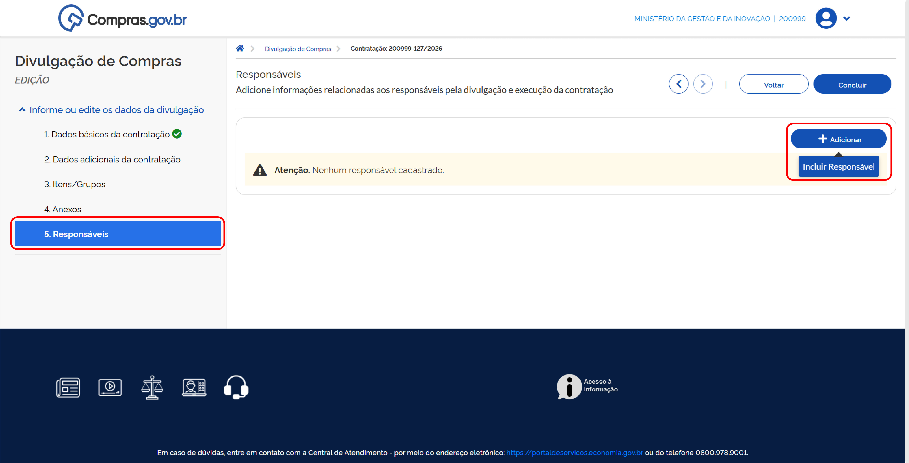

**Passo 52:** Insira o CPF e o e-mail do responsável, selecione seu Cargo/Função e clique em **Adicionar**.

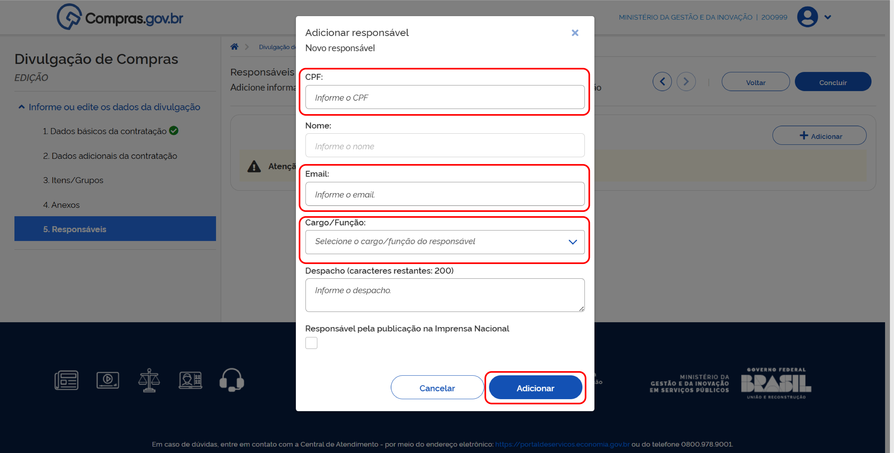

!!! warning "Atenção"
    É necessário indicar um servidor ou servidora responsável pela publicação na Imprensa Nacional, que deverá ser cadastrado junto à Imprensa Nacional para essa função.

!!! note "Nota"
    Devem ser inseridos, no mínimo, os seguintes responsáveis:
    
    * **Pregão** - Pregoeiro
    * **Concorrência e Concurso** - Agente de contratação ou membro de comissão de contratação

**Passo 53:** Depois de preencher essas informações, clique em **Concluir** para que a contratação seja encaminhada para publicação.

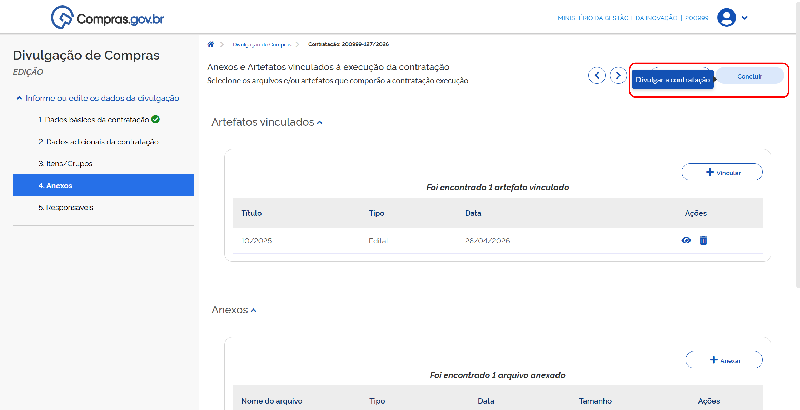

**Passo 54:** Para visualizar a prévia da matéria no Diário Oficial da União, clique em **Visualizar prévia**.

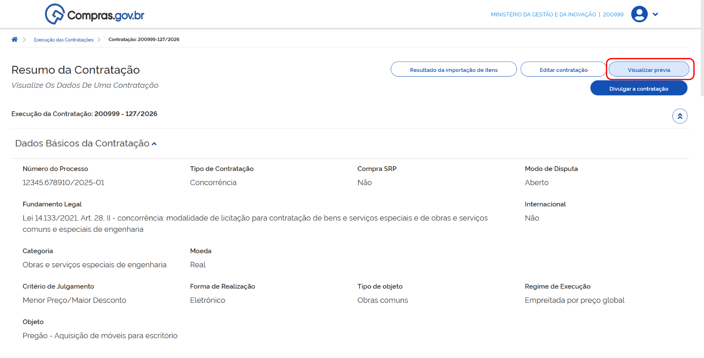

**Passo 55:** Verifique os dados apresentados.

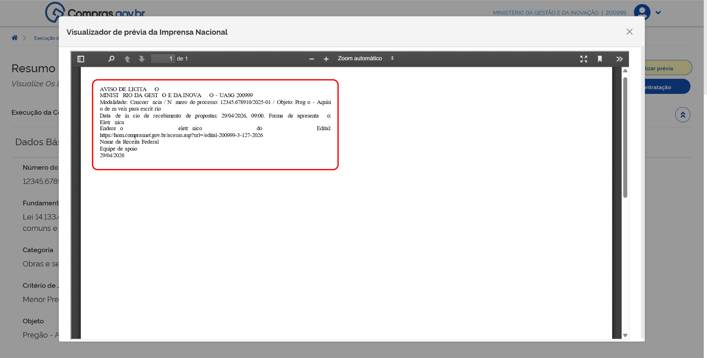

**Passo 56:** Na página de *Resumo da Contratação* clique em **Divulgar a contratação**.

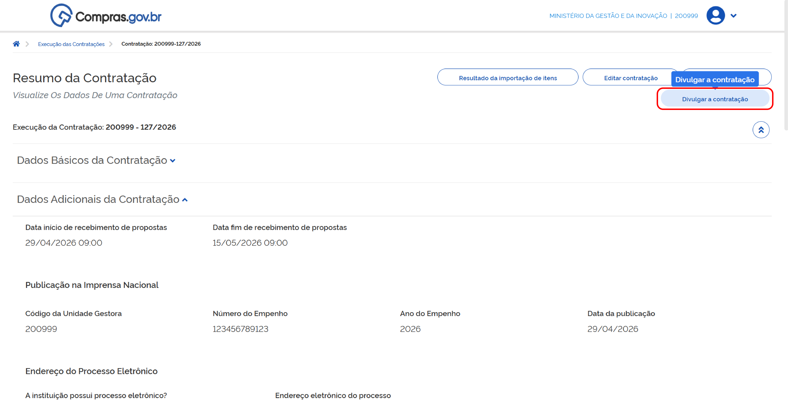

A contratação será divulgada no Portal Nacional de Contratações Públicas (PNCP).

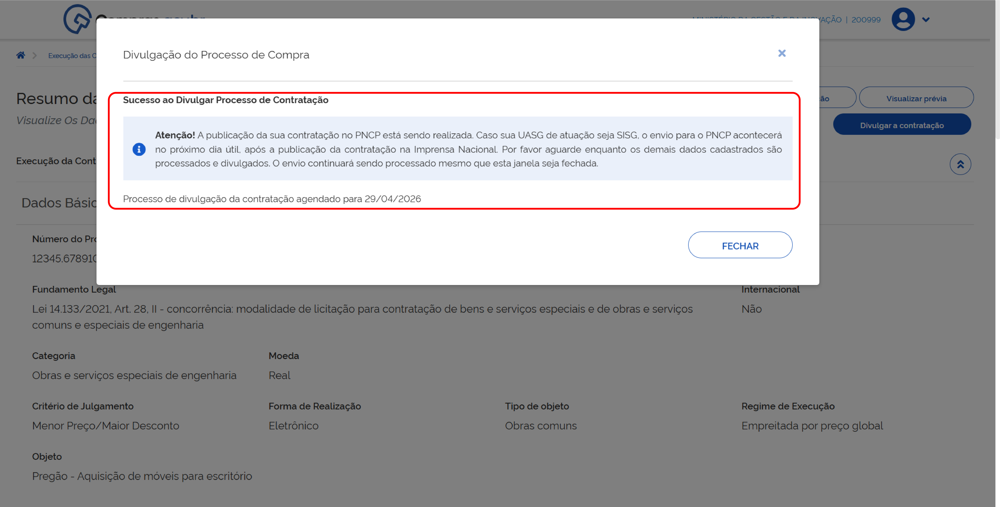

Para visualizá-la, vá para a tela inicial do Novo Divulgação de Compras (Novo DC), escolha a aba **Contratações em Andamento** e clique no número da contratação.

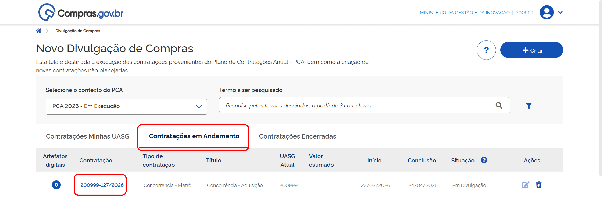

Sua contratação poderá receber propostas conforme as datas que foram colocadas na aba *Dados básicos da contratação*.

---

# INCLUIR E DIVULGAR RESULTADOS DA LICITAÇÃO

!!! warning "Atenção"
    Após realizar todas as etapas da contratação presencial, é obrigatório incluir os resultados no sistema e divulgá-los no Portal Nacional de Contratações Públicas (PNCP).

**Passo 01:** Na aba **Contratações em Andamento**, encontre a contratação desejada, clique nos três pontinhos e depois em **Resultado**.

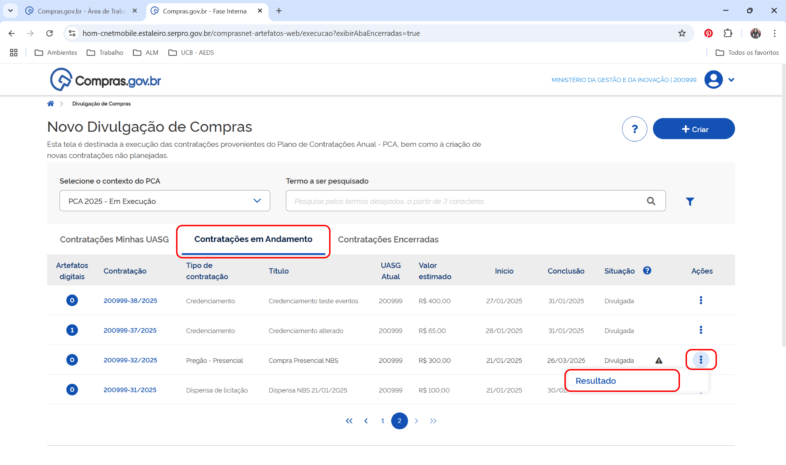

**Passo 02:** Na próxima tela, localize o campo de itens, clique em **+ Resultado**.

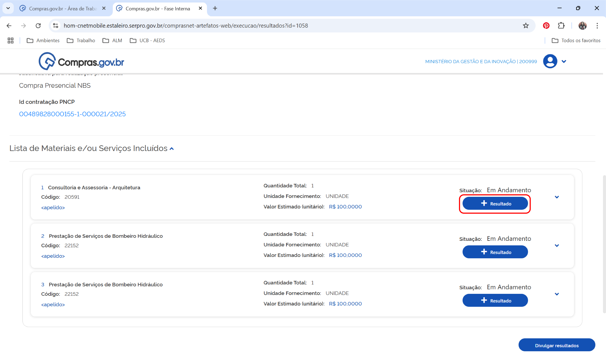

**Passo 03:** Escolha a opção conforme a necessidade:

* Se há um fornecedor vencedor para a contratação, escolha a opção **Incluir Vencedor**;
* Se não houve participantes no processo, selecione a opção **Deserto**;
* Se a seleção do melhor fornecedor não teve sucesso, clique em **Fracassado**.

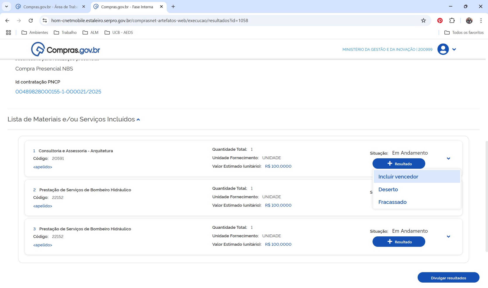

!!! warning "Atenção"
    Conforme informado no item **Inclusão de itens na contratação**, cada item da licitação será adjudicado a uma agência adjudicatária. Repita o processo de inclusão de resultado para todos os itens antes de divulgar o resultado.

### Incluir fornecedor vencedor da contratação presencial

**Passo 04:** Inclua:

* CNPJ ou CPF do fornecedor;
* modelo, valor e quantidade do item.

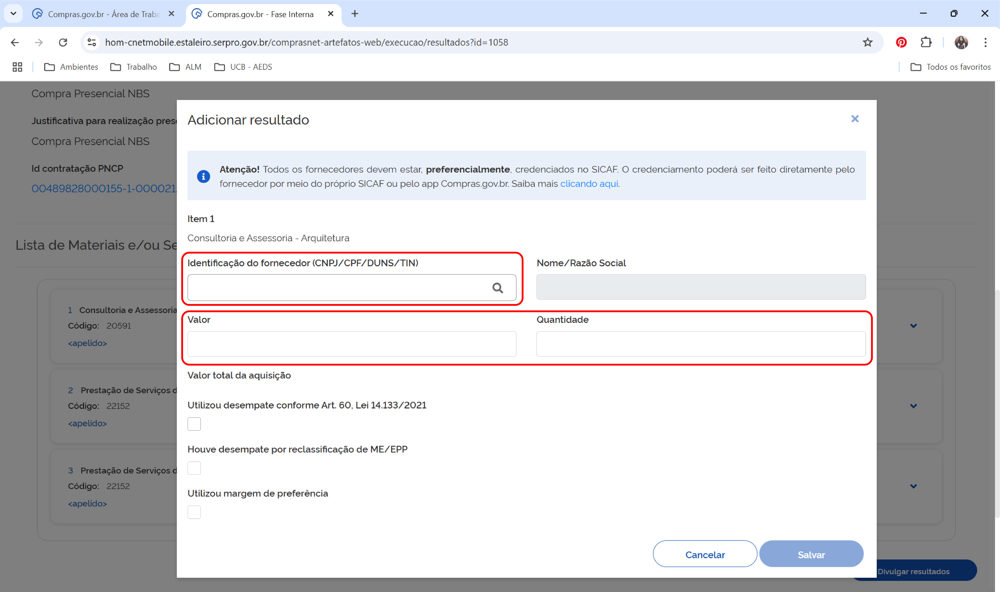

**Passo 05:** Na tela *Adicionar resultado*, selecione os benefícios e critérios de desempates usados para o resultado, caso tenham sido applied. Para finalizar, clique em **Salvar**.

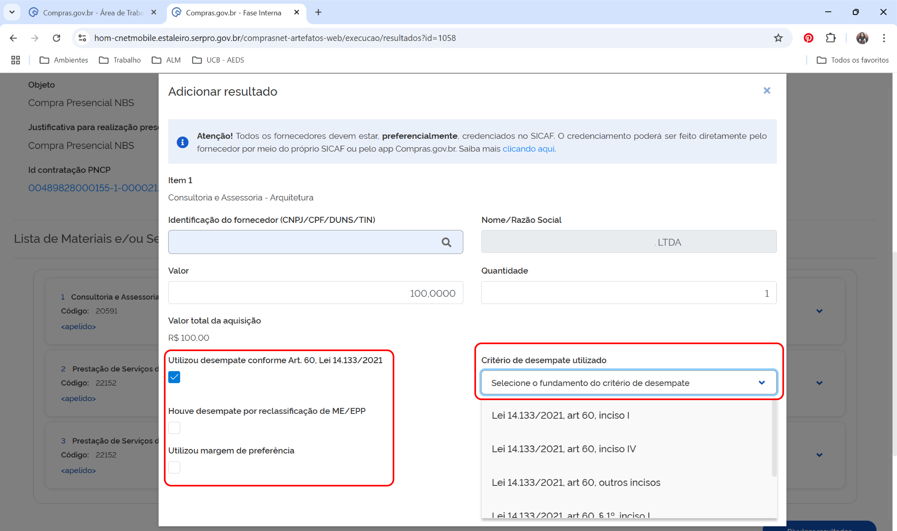

**Passo 06:** Depois de registrar o resultado de todos os itens, clique em **Divulgar resultados**

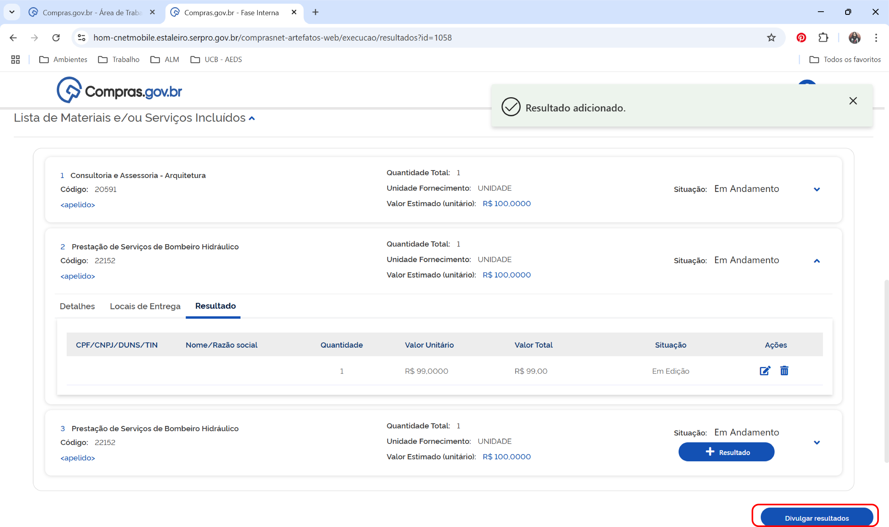

e confirme.

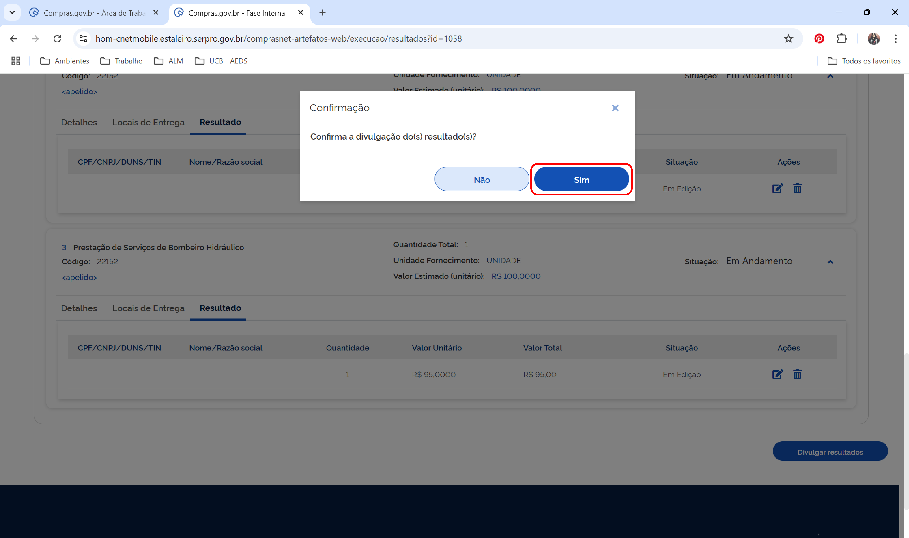

**Passo 07:** Em seguida aparecerá a informação **Resultado(s) divulgado(s) com sucesso**.

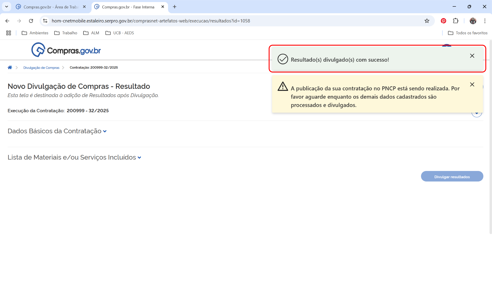

Enquanto a contratação é encaminhada para o Portal Nacional de Contratações Públicas (PNCP), ela ainda pode ser encontrada na aba **Contratações em andamento**.

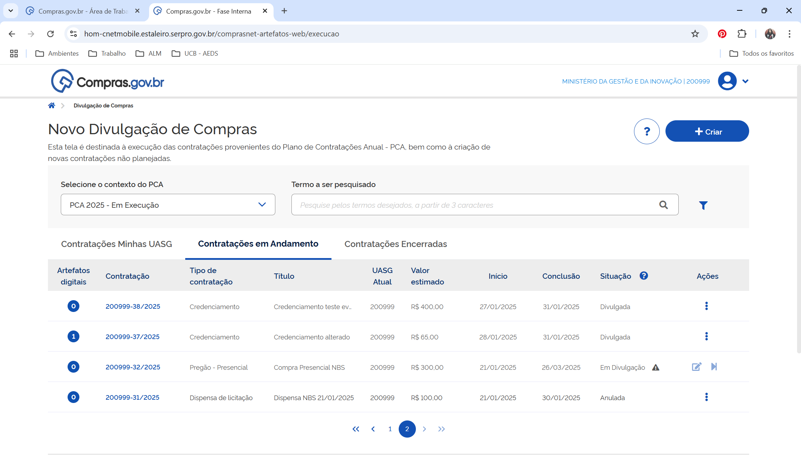

Após a publicação, ela será encaminhada para a aba **Contratações encerradas**.

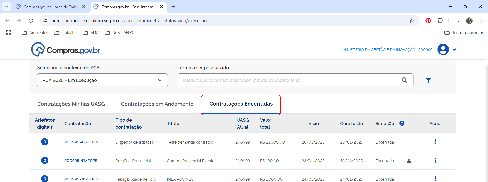

 

  <button onclick="window.print()" style="background-color: #0056b3; color: white; padding: 10px 20px; border: none; border-radius: 5px; font-size: 16px; cursor: pointer; box-shadow: 0 2px 4px rgba(0,0,0,0.2);">
    🖨️ Imprimir ou baixar esta página
  </button>

